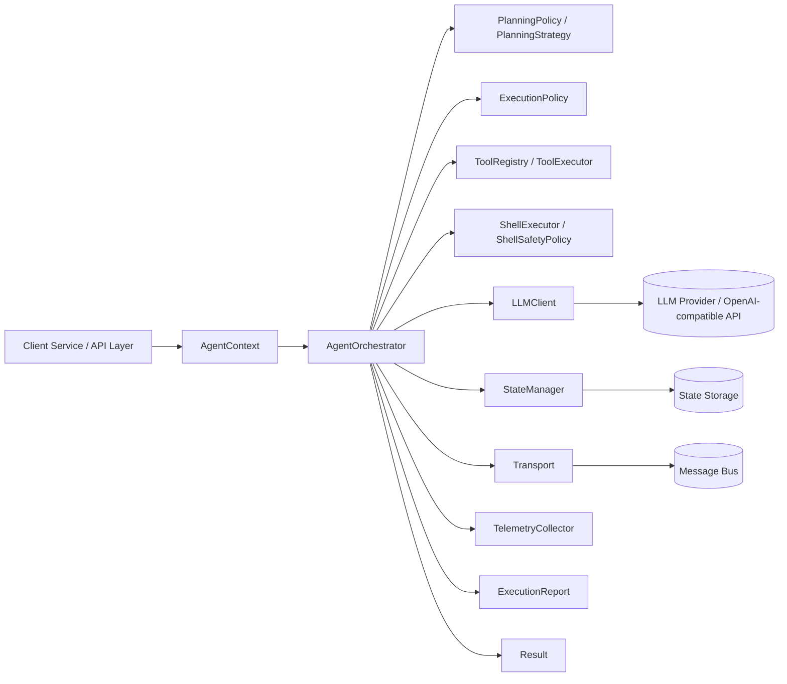
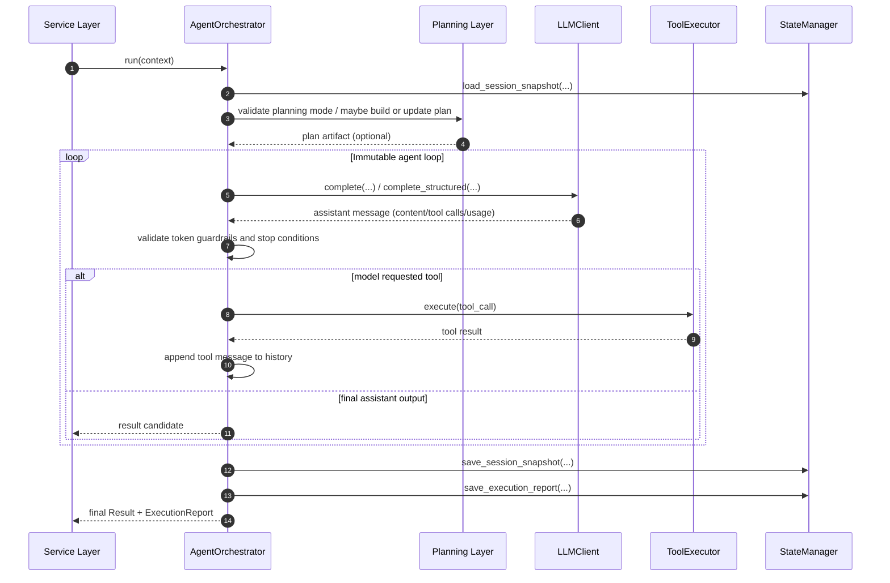
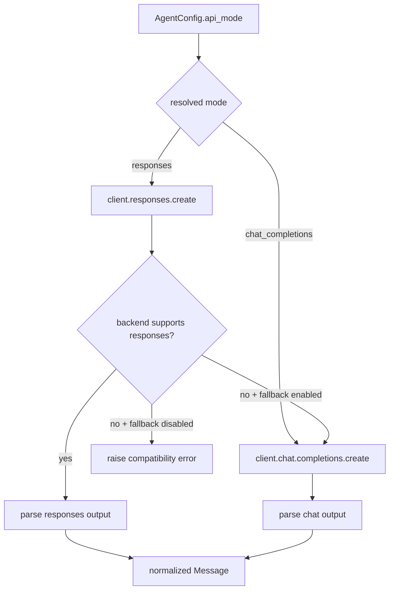
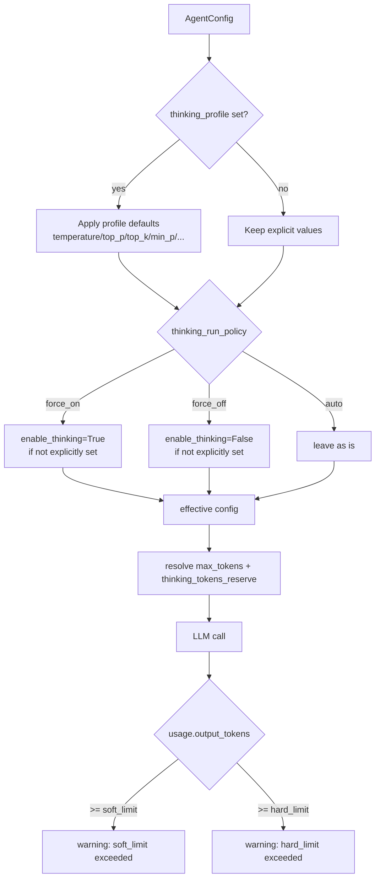
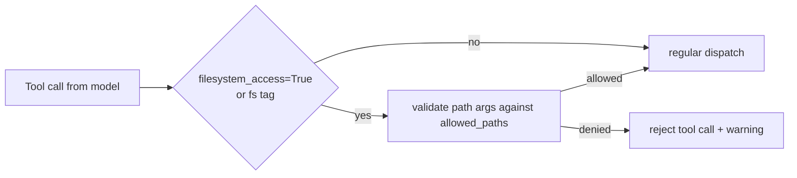

# Архитектура Protocore

Документ описывает, как работает ядро оркестрации: от входного контекста до результата, отчётов и сохранения состояния.

## 0) Структура пакета и импорты

Единственный канонический пакет — `protocore`. Вся логика ядра живёт в нём;
внешние интеграции (например, OpenAI-клиент) — в подпакете `integrations`.

- **Публичный API:** импортируйте из корня пакета:
  `from protocore import AgentOrchestrator, AgentConfig, Message, OpenAILLMClient, make_agent_context, ToolRegistry, ...`
- **Типы и протоколы:** доступны там же (`AgentConfig`, `ExecutionMode`, `LLMClient`, `ToolExecutor` и т.д.).
- **Подмодули** (для продвинутой интеграции): `protocore.types`, `protocore.protocols`, `protocore.events`, `protocore.compression`, `protocore.hooks`, `protocore.integrations.llm`.

Конкретная реализация LLM (OpenAI/vLLM-совместимый клиент) вынесена в
`protocore.integrations.llm.openai_client.OpenAILLMClient`; свой адаптер можно
реализовать по протоколу `LLMClient` и передать в `AgentOrchestrator(llm_client=...)`.

## 1) Общая схема компонентов

## 2) Последовательность выполнения запроса

## 3) Режимы LLM API и fallback

## 4) Thinking-модели: selective thinking и guardrails

## 5) Контракт безопасности инструментов ФС

## 6) Что важно для интеграции

- `AgentOrchestrator` остается единой точкой входа для выполнения.
- Все внешние компоненты внедряются как адаптеры; ядро не зависит от конкретных SDK/БД/очередей.
- Shell-доступ оформлен как встроенный capability: для модели это обычный tool call, для сервиса — отдельный sandbox-aware протокол исполнения.
- Для shell `cwd` применяется path isolation через `allowed_paths`; запросы вне разрешенных путей отклоняются до вызова runtime.
- Для thinking-моделей управление переносится в конфиг (`thinking_profile`, `thinking_run_policy`,
  `thinking_tokens_reserve`, `output_token_*_limit`) без привязки к конкретному провайдеру.
- Для OpenAI-совместимых backend рекомендуется тестировать оба режима (`responses` и `chat_completions`)
  и явно включать fallback только там, где это ожидается.
- Видимость инструментов управляется через `AgentConfig.tool_definitions`:
  если список пуст, оркестратор показывает инструменты из `ToolRegistry`.
- AUTO_SELECT по умолчанию использует LLM-маршрутизацию по `AgentConfig.description`.
- Capability-based маршрутизация учитывает confidence; при низкой уверенности
  включается fallback policy вместо жёсткого выбора.
- В `PARALLEL` `ExecutionReport.input_tokens/output_tokens` могут уже включать
  child runs; для явной интерпретации используйте `parent_tokens()`,
  `child_tokens_sum()` и `total_tokens_including_subagents()`.
- `WorkflowEngine` не получает авто-агрегацию usage: engine сам заполняет
  `ExecutionReport`, при необходимости через `accumulate_usage_from_llm_calls(...)`.
- Полный перечень примеров кода и рецептов интеграции — в `docs/examples.md`.
  Запускаемые скрипты — в каталоге `examples/` (в т.ч. с мок-LLM без внешнего API).
